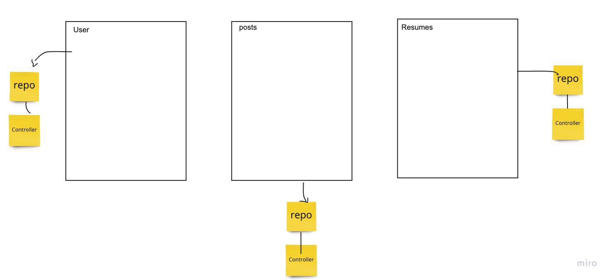
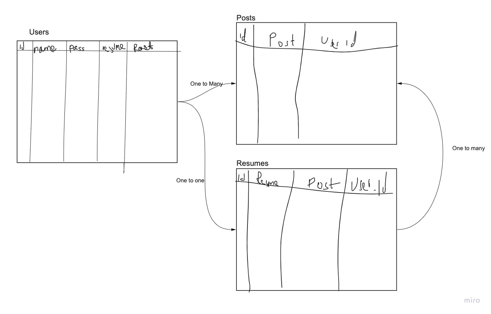

## user Stories
- as a user i want to submit my resume file to show on my profile
- as a user i want to be able to interact with my resume and posts to edit them
- as an admin i want to be able to view all users on the website to keep track
- as a user i want to be able to comment under other peoples resume to suggest edits.
- as an admin i want to be able to delete users.

## Software Requirements

### What is the vision of this product?
to have a place where people can post there resumes without having to fear bias. We will post the resumes and cover things like name and address to avoid the reader of the resume developing biases

### What pain point does this project solve?
helps worker to get hired based on they skills and experience and helps aviod biases from the hiring person.
### Why should we care about your product?
this will help a lot of minorities and people who have been refused jobs solely based on their ethnic or religious background. This will also help companies choose only the best based on skill.

## Scope (In/Out

### IN - What will your product do

- The web app will provide other resumes of users to other users.
- Users can update their resumes.
- Users can iteract with other users resumes and suggest edits and give constructive criticism.

### OUT - What will your product not do

- My product will never cost money to use.
- my product will never sell your info to 3rd parties.

## MVP
[1] Platform where client has resumes for people to see  - allow client to have resumes and upload them
[2] Find : languages, tools, names, company interests.
[3a] User creates an account
[3b] Fills in the boxes.
[3c] Creates and posts resume.
[4] able to view and interact with other users resumes
[5] able to update resumes and view suggested edits
## Stretch Goals
[1x] Scrape from the web to create a resume temple based on the link  user provided 
[2] search for API's or create one to incorporate into the web app
[3] put the resumes in carousel and  have a user swipe and choose through them.

## Domain Modeling

## Make an Database Schema Diagram

